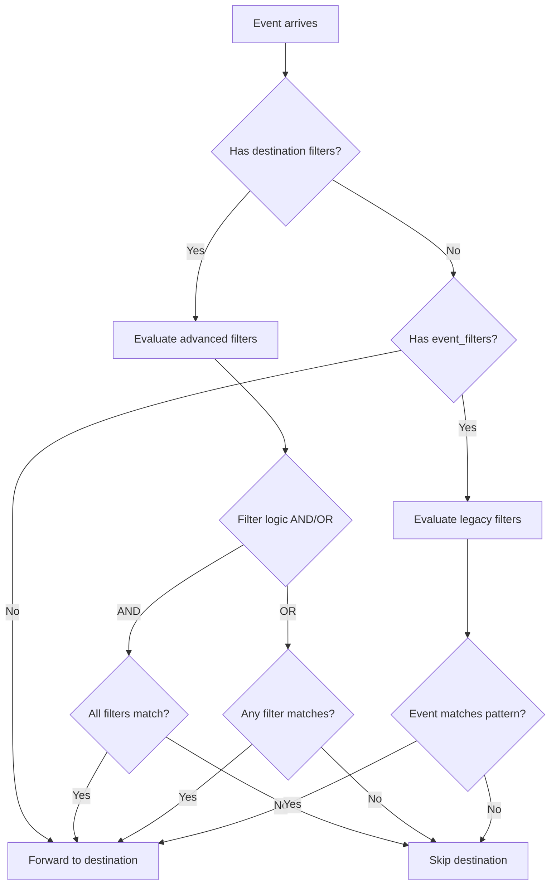

# Destination-Specific Filters

## Tổng quan

Tính năng **Destination-Specific Filters** cho phép bạn áp dụng các filter rule phức tạp cho từng HTTP destination riêng biệt. Khác với global filters (áp dụng cho tất cả events trước khi xử lý), destination filters được evaluate riêng cho từng destination để quyết định event có được forward đến destination đó hay không.

## Tính năng chính

- ✅ **Advanced Filter Rules**: Hỗ trợ tất cả operators như global filters (equals, regex, contains, starts_with, v.v...)
- ✅ **AND/OR Logic**: Tùy chọn filter logic cho mỗi destination
- ✅ **Backward Compatibility**: Vẫn hỗ trợ `event_filters` cũ (simple string matching)
- ✅ **Per-Destination Configuration**: Mỗi destination có thể có filter rules riêng biệt
- ✅ **Full Event Access**: Có thể filter dựa trên bất kỳ event header nào
- ✅ **Comprehensive Logging**: Debug logs chi tiết cho filter evaluation

## Cấu hình

### Cấu trúc Filter cho Destination

```yaml
http:
  destinations:
    - name: "destination-name"
      url: "https://example.com/webhook"
      
      # Option 1: Advanced filters (recommended)
      filter_logic: "AND"  # or "OR" - default is "AND"
      filters:
        - field: "Event-Name"
          operator: "equals"
          value: "CUSTOM"
        
        - field: "CC-Action"
          operator: "regex"
          value: "^agent-(status|state)-change$"
      
      # Option 2: Legacy event filters (for backward compatibility)
      event_filters:
        - "CUSTOM callcenter::*"
        - "HEARTBEAT"
      
      # Option 3: No filters (receives all events)
```

### Supported Operators

Destination filters hỗ trợ tất cả operators giống như global filters:

| Operator | Mô tả | Ví dụ |
|----------|-------|-------|
| `equals` | Exact match | `value: "CUSTOM"` |
| `not_equals` | Not equal | `value: "HEARTBEAT"` |
| `contains` | Contains substring | `value: "agent"` |
| `not_contains` | Does not contain | `value: "error"` |
| `starts_with` | Starts with prefix | `value: "manager-"` |
| `ends_with` | Ends with suffix | `value: "-change"` |
| `regex` | Regular expression | `value: "^agent-(status\|state)$"` |

### Filter Logic

- **`AND`** (default): Tất cả filters phải match
- **`OR`**: Chỉ cần 1 filter match

## Ví dụ cấu hình

### 1. Agent Status Monitoring

```yaml
- name: "agent-status-monitor"
  url: "https://api.example.com/agent-status"
  
  filter_logic: "AND"
  filters:
    - field: "Event-Name"
      operator: "equals"
      value: "CUSTOM"
    
    - field: "Event-Subclass"
      operator: "equals"
      value: "callcenter::info"
    
    - field: "CC-Action"
      operator: "regex"
      value: "^agent-(status|state)-change$"
```

### 2. Support Queue với OR Logic

```yaml
- name: "support-queue-monitor"
  url: "https://api.example.com/support"
  
  filter_logic: "OR"
  filters:
    # Support queue events
    - field: "CC-Queue"
      operator: "equals"
      value: "support"
    
    # Manager override (any queue)
    - field: "CC-Agent"
      operator: "starts_with"
      value: "manager-"
```

### 3. External Call Tracking

```yaml
- name: "external-call-tracker"
  url: "https://api.example.com/external-calls"
  
  filter_logic: "AND"
  filters:
    - field: "Event-Name"
      operator: "equals"
      value: "CHANNEL_CREATE"
    
    # External phone numbers only
    - field: "Caller-Caller-ID-Number"
      operator: "regex"
      value: "^\\+?[1-9]\\d{7,14}$"
```

### 4. High Priority Alerts với OR Logic

```yaml
- name: "critical-alerts"
  url: "https://alerts.example.com/webhook"
  
  filter_logic: "OR"
  filters:
    # Agent logout unexpectedly
    - field: "CC-Action"
      operator: "equals"
      value: "agent-logout"
    
    # Call errors
    - field: "Hangup-Cause"
      operator: "not_equals"
      value: "NORMAL_CLEARING"
    
    # System errors
    - field: "Event-Name"
      operator: "contains"
      value: "ERROR"
```

## Backward Compatibility

### Legacy Event Filters

Destinations vẫn có thể sử dụng `event_filters` cũ:

```yaml
- name: "legacy-destination"
  url: "https://example.com/webhook"
  
  # Legacy simple filters
  event_filters:
    - "HEARTBEAT"
    - "CUSTOM callcenter::*"
    - "CHANNEL_*"
```

### Migration Strategy

1. **Giữ nguyên** `event_filters` hiện tại
2. **Thêm** `filters` và `filter_logic` cho advanced filtering
3. **Priority**: Nếu có `filters`, sẽ sử dụng advanced filters, bỏ qua `event_filters`

## Cách hoạt động

### Filter Evaluation Flow



### Performance Considerations

1. **Filter Order**: Advanced filters có priority cao hơn legacy filters
2. **Short-circuit**: AND logic dừng lại ở filter đầu tiên fail
3. **Regex Caching**: Regex patterns được compile mỗi lần (có thể optimize sau)
4. **Parallel Processing**: Destinations được evaluate parallel

## Debugging

### Enable Debug Logging

```yaml
logging:
  level: "debug"
  format: "console"
```

### Debug Log Examples

```log
DEBUG http Evaluating destination filters
  destination=agent-status-monitor 
  event_name=CUSTOM 
  filter_count=3 
  filter_logic=AND

DEBUG http Event passed all destination AND filters
  destination=agent-status-monitor 
  event_name=CUSTOM 
  filter_count=3

DEBUG http Event filtered out by destination AND logic
  destination=inbound-call-tracker 
  event_name=CUSTOM 
  filter_field=Event-Name 
  filter_operator=equals 
  filter_value=CHANNEL_CREATE
```

## Best Practices

### 1. Filter Organization

```yaml
# ✅ Good: Specific and clear filters
filters:
  - field: "Event-Name"
    operator: "equals"
    value: "CUSTOM"
  
  - field: "CC-Action"
    operator: "regex"
    value: "^agent-state-change$"

# ❌ Avoid: Too broad or unclear
filters:
  - field: "Event-Name"
    operator: "contains"
    value: "C"  # Too broad
```

### 2. Logic Selection

```yaml
# Use AND for strict filtering
filter_logic: "AND"  # All conditions must be true

# Use OR for multiple scenarios
filter_logic: "OR"   # Any condition can be true
```

### 3. Performance

- **Exact matches** (equals) nhanh hơn regex
- **Simple patterns** tốt hơn complex regex
- **Field order**: Đặt filters dễ fail trước (cho AND logic)

### 4. Maintainability

```yaml
# ✅ Good: Descriptive destination names
- name: "support-queue-agent-status-monitor"

# ✅ Good: Comments explaining complex filters
filters:
  # Only US/Canada phone numbers
  - field: "Caller-Caller-ID-Number"
    operator: "regex"
    value: "^\\+?1[2-9]\\d{9}$"
```

## Complete Example

```yaml
http:
  destinations:
    # Production monitoring
    - name: "production-alerts"
      url: "https://alerts.company.com/webhook"
      filter_logic: "OR"
      filters:
        - field: "CC-Action"
          operator: "equals"
          value: "agent-logout"
        - field: "Hangup-Cause"
          operator: "not_equals"
          value: "NORMAL_CLEARING"
    
    # Development debugging
    - name: "dev-debug"
      url: "https://dev.company.com/webhook"
      filter_logic: "AND"
      filters:
        - field: "Event-Name"
          operator: "contains"
          value: "CUSTOM"
        - field: "CC-Queue"
          operator: "equals"
          value: "test-queue"
    
    # Legacy system
    - name: "legacy-system"
      url: "https://legacy.company.com/webhook"
      event_filters:
        - "HEARTBEAT"
        - "CHANNEL_*"
    
    # Audit logging (all events)
    - name: "audit-logger"
      url: "https://audit.company.com/webhook"
      # No filters = receive all events
```

## Migration Guide

### From Event Filters to Advanced Filters

**Before:**
```yaml
event_filters:
  - "CUSTOM callcenter::*"
```

**After:**
```yaml
filter_logic: "AND"
filters:
  - field: "Event-Name"
    operator: "equals"
    value: "CUSTOM"
  - field: "Event-Subclass"
    operator: "starts_with"
    value: "callcenter::"
```

### Complex Pattern Migration

**Before:**
```yaml
event_filters:
  - "CHANNEL_CREATE"
  - "CHANNEL_HANGUP"
```

**After:**
```yaml
filter_logic: "OR"
filters:
  - field: "Event-Name"
    operator: "equals"
    value: "CHANNEL_CREATE"
  - field: "Event-Name"
    operator: "equals"
    value: "CHANNEL_HANGUP"
```

**Or simpler:**
```yaml
filter_logic: "AND"
filters:
  - field: "Event-Name"
    operator: "regex"
    value: "^CHANNEL_(CREATE|HANGUP)$"
``` 